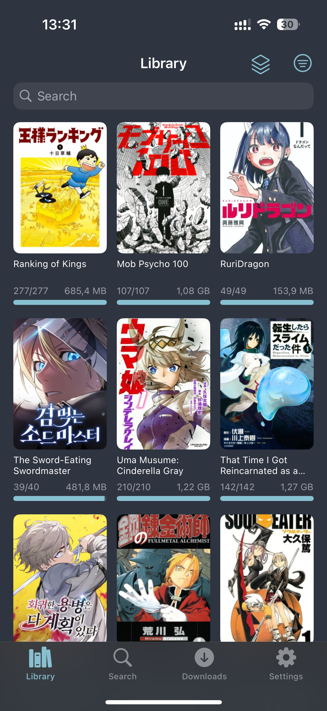
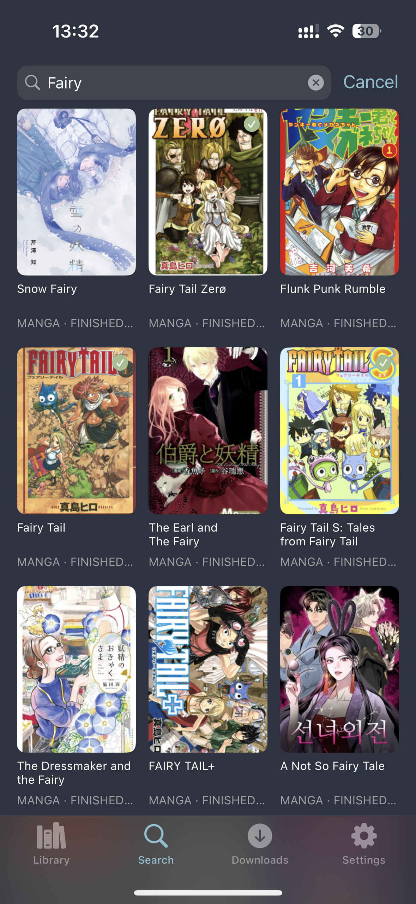
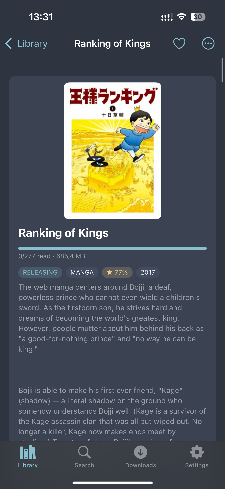
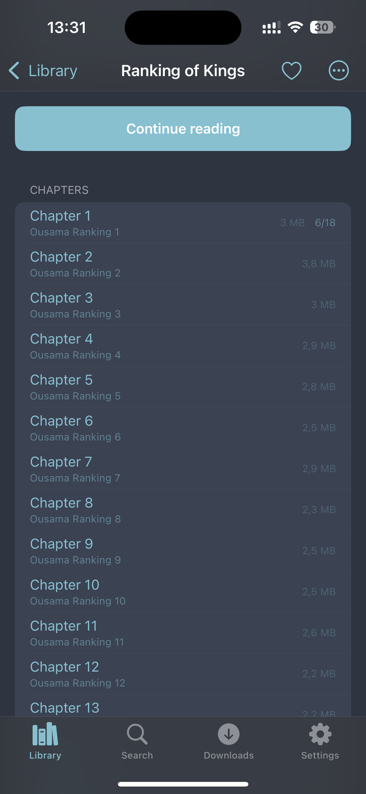
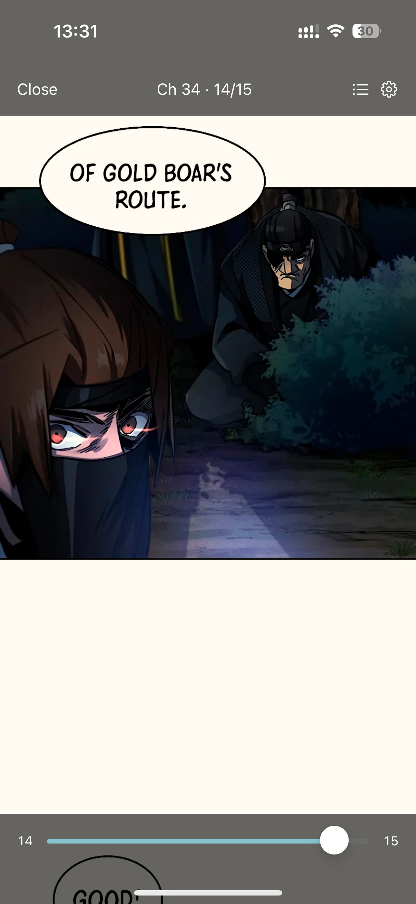
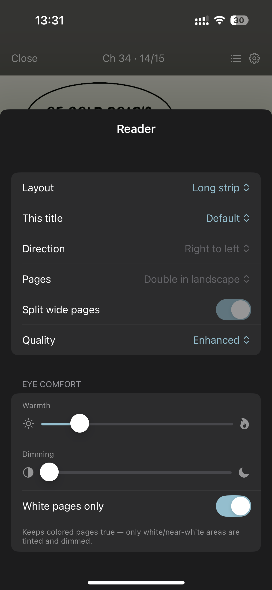

  
  <h1>Kaodoku for iOS</h1>

A companion app for the [Kaodoku](../README.md) manga server. Connect it to your
server to download and read your manga on iPhone and iPad — online, or fully
offline.

## Screenshots

  
  
  
  
  
  

## Features

- Search and browse your library, with collections and per-title reader settings.
- Paged (LTR/RTL, single/double) and long-strip reader modes.
- Eye-comfort controls: warmth, dimming, and white-only tinting.
- Offline downloads — read device CBZs with no connection; progress syncs back.
- Multi-server: save several servers, auto-routing between local and public URLs.

## Installing

There is **no App Store or TestFlight build**. I'm currently broke teehee and not
paying for the Apple Developer Program ($99/yr), so the only way to install is
**self-loading**: build it yourself in Xcode and run it on your own device (self-hosting duh).

### Requirements

- A Mac with Xcode.
- An Apple ID (a free personal one works — no paid account needed).
- An iPhone/iPad connected via cable (or on the same network for wireless run).

### Steps

1. Open `Kaodoku.xcodeproj` in Xcode.
2. Select the **Kaodoku** target → **Signing & Capabilities**, sign in with your
   Apple ID, and pick your **Personal Team**. Change the bundle identifier to
   something unique if signing fails.
3. Plug in your device, select it as the run destination, and press **Run**.
4. On the device, trust the developer certificate under
   **Settings → General → VPN & Device Management**.

> **Free-account caveat:** apps signed with a free personal team expire after
> **7 days** and must be rebuilt/reinstalled. You can have at most 3 such apps
> installed at once. A paid account would remove these limits and enable
> TestFlight (not happening until the wallet fattens).

## Connecting

Launch the app and add your server's URL (and credentials, if the server has
accounts enabled). You can save both a local and a public address for the same
server; the app probes and routes to whichever is reachable.
